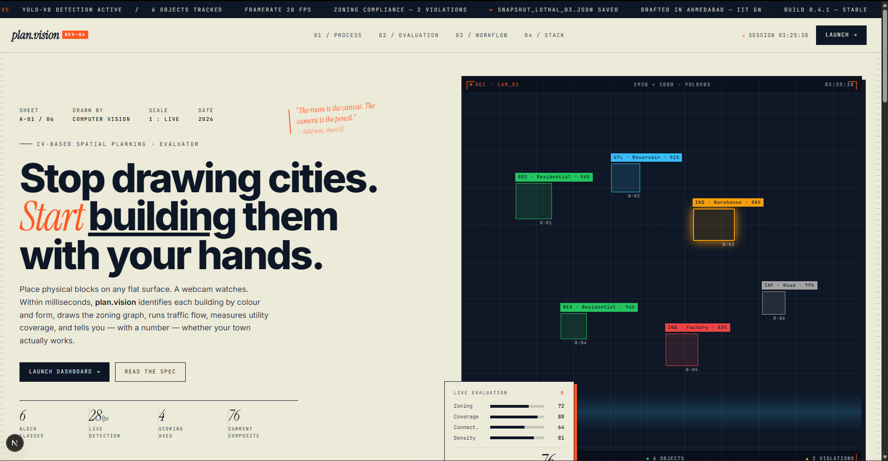
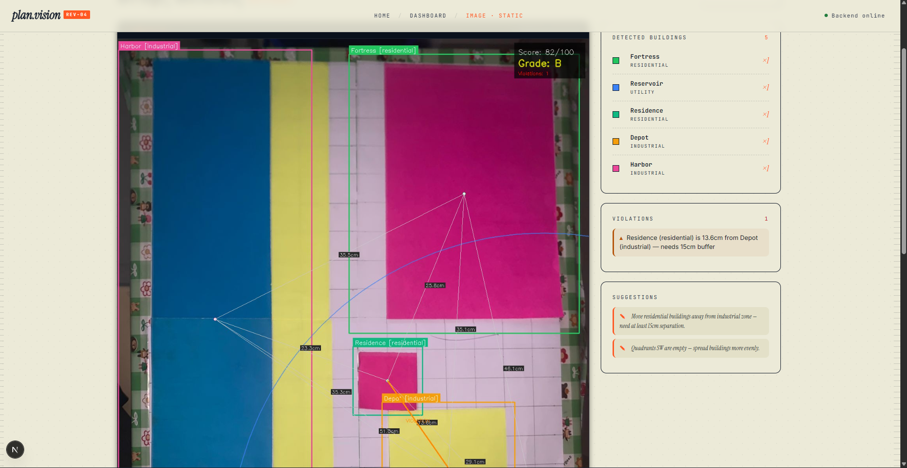
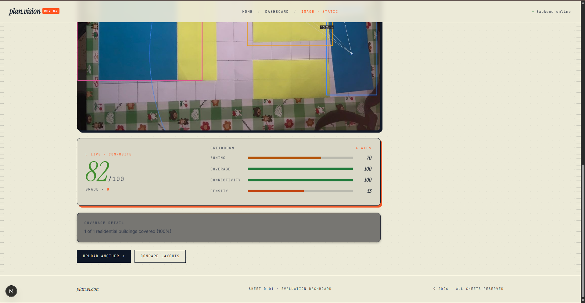

# PlanVision -- Real-Time Spatial Planning Evaluation System

A computer vision system for real-time spatial planning analysis. Physical building blocks are arranged on a surface, detected via a custom-trained YOLOv8 model, and evaluated against spatial planning criteria -- zoning compliance, utility coverage, connectivity, and density balance -- all in real-time.

> Model training notebook: [`model_training.ipynb`](model_training.ipynb)
> Live Demo: https://archi-cv.vercel.app/

---

## Table of Contents

- [Overview](#overview)
- [Architecture](#architecture)
- [Data Pipeline](#data-pipeline)
  - [Image Acquisition](#image-acquisition)
  - [Format Conversion](#format-conversion)
  - [Manual Labeling](#manual-labeling)
  - [Dataset Statistics](#dataset-statistics)
  - [Dataset Balancing & Data Augmentation](#dataset-balancing--data-augmentation)
- [Custom YOLOv8 Model](#custom-yolov8-model)
  - [Model Selection](#model-selection)
  - [Training Configuration](#training-configuration)
  - [Training Runs and Iteration](#training-runs-and-iteration)
  - [Final Model Performance](#final-model-performance)
  - [Per-Class Performance](#per-class-performance)
  - [Inference Latency](#inference-latency)
- [Spatial Evaluation Engine](#spatial-evaluation-engine)
- [Block Registry](#block-registry)
- [Web Dashboard](#web-dashboard)
- [API Reference](#api-reference)
- [Project Structure](#project-structure)
- [Setup and Installation](#setup-and-installation)
- [Usage](#usage)
- [Scoring Methodology](#scoring-methodology)
- [License](#license)

---

## Overview

PlanVision bridges physical model-building with computational planning analysis. Instead of working with CAD software or digital simulations, users arrange coloured blocks on a flat surface. An overhead camera captures the layout, a custom object detection model identifies each building type, and a spatial evaluation engine grades the layout across four independent planning axes.

The system provides two modes of operation:

- **Image Upload** -- Upload a photograph of a block layout for one-shot analysis.
- **Live Camera** -- Continuous real-time detection and evaluation at approximately 28 fps.

---





## Architecture

The system follows a three-stage pipeline: image acquisition, object detection, and spatial evaluation. The detection backend and evaluation engine run as a unified Flask server, while the frontend consumes results via a polling-based REST API.

```
                                SYSTEM ARCHITECTURE

+-------------------+     YOLOv8      +-------------------+    Spatial     +---------------------+
|   Webcam /        | -------------> |   Object           | -----------> |   Evaluation         |
|   Uploaded        |                |   Detection        |              |   Engine             |
|   Image           |                |   (mai.py)         |              |   (spatial_engine)   |
+-------------------+                +---------+----------+              +----------+-----------+
                                               |                                    |
                                        OpenCV Window                         Flask API :5000
                                        (Annotated Feed)                            |
                                                                          +---------+----------+
                                                                          |   Next.js :3000    |
                                                                          |  +---------------+ |
                                                                          |  | Dashboard     | |
                                                                          |  | Compare       | |
                                                                          |  | Landing       | |
                                                                          |  +---------------+ |
                                                                          +--------------------+
```

### Data Flow Diagram

```
  Raw Photos           Converted          Labeled            Trained           Deployed
  (HEIC/JPG)           (JPG)             (YOLO fmt)          Model             System
 +---------+         +---------+        +---------+       +---------+       +---------+
 |  Phone  | ------> | Format  | -----> | Manual  | ----> | YOLOv8  | ----> | Flask + |
 |  Camera | convert | .jpg    | label  | BBox    | train | nano    | serve | Next.js |
 +---------+         +---------+        +---------+       +---------+       +---------+
     255 images          255 images        255 labels        best.pt          Live/Upload
```

---

## Data Pipeline

### Image Acquisition

All training images were **manually captured** using a phone camera. Physical building blocks (coloured wooden/plastic pieces representing town planning structures) were placed on a flat surface and photographed from varying angles, distances, and lighting conditions.

Multiple photography sessions were conducted to ensure dataset diversity:

| Factor                   | Variation                                              |
|--------------------------|--------------------------------------------------------|
| Camera angle             | Overhead, slight tilt                                  |
| Lighting                 | Natural daylight, artificial indoor light              |
| Background surface       | Varied flat surfaces                                   |
| Objects per frame        | Single object per image (one class per photo)          |
| Distance                 | Near (~20 cm) to far (~50 cm)                          |
| Original format          | HEIC (Apple), JPG                                      |

### Format Conversion

Raw images from the phone camera were captured in HEIC format. A preprocessing step in [`model_training.ipynb`](model_training.ipynb) converts all HEIC files to JPEG at 95% quality using `pillow-heif`, while preserving the directory structure organized by class.

```python
# HEIC to JPG conversion (from model_training.ipynb)
pillow_heif.register_heif_opener()
img = Image.open(src).convert("RGB")
img.save(dst, "JPEG", quality=95)
```

### Manual Labeling

Every image in the dataset was **manually annotated by hand** with bounding box labels. No automated or semi-automated labeling tools were used. Each object instance was individually labeled with one of seven class categories corresponding to building types in the town planning model.

Annotations were exported in YOLO format -- one `.txt` file per image containing normalized coordinates:

```
class_id  x_center  y_center  width  height
```

All values are normalized to `[0, 1]` relative to image dimensions.

The labeled data was organized into the standard YOLO directory structure:

```
yolo_data/
  images/
    train/
      Warehouse_IMG20260122185618.jpg
      Reservoir_IMG20260122185239.jpg
      ...
  labels/
    train/
      Warehouse_IMG20260122185618.txt
      Reservoir_IMG20260122185239.txt
      ...
```

### Dataset Statistics

The `yolo backend` workspace contains **1,775 total image files** across raw captures, format conversions, train/val/test splits, and inference outputs:

- **Raw Captured Images**: **367** original high-resolution photographs across 7 building classes.
- **Converted Images**: **367** normalized JPEG format images (1:1 conversion from raw/HEIC).
- **Final Dataset Split (V2)**: **367** images partitioned into:
  - `train`: **255** images (70%)
  - `val`: **71** images (20%)
  - `test`: **41** images (10%)
- **Extended Dataset Workspace (V1)**: **595** images (`train`: 332, `val`: 129, `test`: 76, `train_bead`: 58).
- **Run Outputs & Plots**: **79** evaluation plots and inference result images.

| Metric                          | Value                                                  |
|---------------------------------|--------------------------------------------------------|
| Total image files in backend    | 1,775                                                  |
| Total raw captured images       | 367                                                    |
| Training split size             | 255 images (255 instances)                             |
| Validation split size           | 71 images                                              |
| Test split size                 | 41 images                                              |
| Number of classes               | 7                                                      |
| Annotation format               | YOLO format (normalized `class x_center y_center w h`) |
| Training input size             | 640 x 640                                              |
| Corrupt / Unusable images       | 0 (all validated and restored)                         |

**Per-Class Image Distribution (Raw Captures & Training Split):**

| Class ID | Class Name         | Display Name | Raw Images | Train Split | Train Instances | Share (%) |
|----------|--------------------|--------------|------------|-------------|-----------------|-----------|
| 0        | warehouse          | Depot        | 50         | 35          | 35              | 13.7%     |
| 1        | reservoir          | Reservoir    | 67         | 46          | 46              | 18.0%     |
| 2        | loading_platform   | FreightDeck  | 56         | 39          | 39              | 15.3%     |
| 3        | dockyard           | Harbor       | 40         | 28          | 28              | 11.0%     |
| 4        | citadel            | Fortress     | 52         | 36          | 36              | 14.1%     |
| 5        | big_house          | Residence    | 39         | 27          | 27              | 10.6%     |
| 6        | bead_factory       | Factory      | 63         | 44          | 44              | 17.3%     |
| **Total**|                    |              | **367**    | **255**     | **255**         | **100%**  |

### Dataset Balancing & Data Augmentation

To address slight class imbalance between majority classes (e.g., `reservoir` at 18.0%) and minority classes (e.g., `big_house` at 10.6%), **dynamic online data augmentation** was implemented during training rather than static offline duplication:

1. **Mosaic Augmentation (`mosaic = 1.0`)**: Stitches 4 random training images from different classes into a single composite frame per iteration. This naturally balances class co-occurrence and forces the model to detect objects across varying spatial densities and scale variations.
2. **Spatial Flips (`flipud = 0.5`, `fliplr = 0.5`)**: Provides full 4-way rotational invariance (vertical and horizontal flips), essential for overhead camera placement where building blocks have no intrinsic "up" orientation.
3. **Rotation Jitter (`degrees = ±15.0°`)**: Simulates minor mounting angle variations and crooked placement on the model surface.
4. **Scale Jitter (`scale = 0.5`)**: Randomly scales input dimensions by ±50% to simulate variations in camera height and distance.
5. **Color Space Tuning (`hsv_s = 0.4`, `hsv_h = 0.015`, `hsv_v = 0.4`)**: Saturation shift was explicitly restricted from the default 0.7 to 0.4 to prevent color-shifting confusion between visual classes (e.g., maintaining clear distinction between yellow bead factories and light residential blocks).
6. **Synthetic Dataset Expansion**: Over 100 training epochs, online augmentation dynamically generated over **2,500+ unique synthetic image views** from the 255 training split images, ensuring strong generalization without overfitting to minority classes.

---

## Custom YOLOv8 Model

### Model Selection

The system uses **YOLOv8 Nano** (`yolov8n.pt`) as the base architecture, selected for its balance of speed and accuracy on resource-constrained hardware.

| Property              | Value                                    |
|-----------------------|------------------------------------------|
| Architecture          | YOLOv8n (Ultralytics)                    |
| Base weights          | COCO-pretrained (`yolov8n.pt`)           |
| Total parameters      | 3,007,013                                |
| Model size (fused)    | 73 layers, ~6.2 MB                       |
| GFLOPs                | 8.1                                      |
| Framework             | Ultralytics 8.4.7                        |
| Runtime               | PyTorch 2.5.1 + CUDA                     |
| GPU                   | NVIDIA GeForce RTX 3050 Laptop (4 GB)    |

### Training Configuration

Training was performed on a local GPU using the following hyperparameters, documented in [`model_training.ipynb`](model_training.ipynb):

| Parameter          | Value   | Rationale                                                   |
|--------------------|---------|-------------------------------------------------------------|
| `epochs`           | 100     | Sufficient convergence window; early stopping applied       |
| `patience`         | 15      | Stop if no mAP improvement for 15 consecutive epochs        |
| `imgsz`            | 640     | Standard YOLOv8 input; balances detail with speed           |
| `batch`            | 8       | Constrained by 4 GB GPU VRAM                                |
| `device`           | 0       | CUDA GPU                                                    |
| `optimizer`        | auto    | Automatically selected MuSGD (lr=0.000909, momentum=0.9)   |

**Augmentation Strategy Summary:**

| Augmentation     | Value | Rationale                                                     |
|------------------|-------|---------------------------------------------------------------|
| `flipud`         | 0.5   | Critical for top-down views -- objects have no natural "up"   |
| `fliplr`         | 0.5   | Standard horizontal flip                                      |
| `degrees`        | 15.0  | Handles slight rotational variance in camera placement        |
| `mosaic`         | 1.0   | Combines 4 images per sample; essential for small datasets    |
| `scale`          | 0.5   | Simulates varying camera distances                            |
| `hsv_s`          | 0.4   | Reduced saturation jitter to preserve color-based class cues  |
| `hsv_h`          | 0.015 | Minimal hue shift to avoid confusing similar-colored objects   |
| `hsv_v`          | 0.4   | Moderate brightness variation                                 |

### Training Runs and Iteration

The model was developed through **four iterative training runs**, each improving on the previous through dataset refinement, hyperparameter tuning, and class adjustments.

| Run   | Name                         | Dataset  | Classes | Images | Epochs Run | Best Epoch | mAP50 (best) | mAP50-95 (best) |
|-------|------------------------------|----------|---------|--------|------------|------------|--------------|-----------------|
| 1     | `town_planning_run`          | data.yaml| 7       | --     | Failed*    | --         | --           | --              |
| 2     | `town_planning_run2`         | data_bead| 1       | 58     | 45         | 25         | 0.985        | 0.751           |
| 3     | `town_planning_final_run`    | data.yaml| 7       | 255    | --         | --         | --           | --              |
| 4     | `town_planning_final_run4`   | data.yaml| 7       | 255    | 85         | 70         | 0.995        | 0.832           |

*Run 1 failed due to a missing `data.yaml` path configuration. Run 2 was a single-class pilot (bead_factory only) used to validate the pipeline. Run 4 is the production model.

**Training Convergence (Final Run -- 7 Classes, 255 Images):**

```
Epoch    mAP50    mAP50-95    Box Loss    Cls Loss
  1      0.317     0.139       1.364       3.120
  5      0.473     0.290       1.197       2.782
 10      0.716     0.530       1.068       2.390
 20      0.965     0.700       1.008       1.797
 30      0.988     0.683       0.978       1.495
 40      0.992     0.766       0.864       1.352
 50      0.993     0.770       0.856       1.276
 58      0.995     0.817       0.850       1.260     <-- mAP50-95 plateau begins
 67      0.995     0.821       0.787       1.210
 70      0.995     0.832       0.793       1.146     <-- Best model (EarlyStopping)
 85      0.995     0.830       0.768       1.143     <-- Training stopped (patience=15)
```

Training completed in **0.405 hours** (approximately 24 minutes).

### Final Model Performance

The production model (`town_planning_final_run4/weights/best.pt`) achieves the following overall metrics:

| Metric                | Value       |
|-----------------------|-------------|
| Precision (P)         | 0.992       |
| Recall (R)            | 0.999       |
| mAP@50                | 0.995       |
| mAP@50-95             | 0.832       |
| Confidence threshold  | 0.40        |
| Total training images | 255         |
| Total training epochs | 85 (early stop at 70) |

### Per-Class Performance

| Class              | Images | Instances | Precision | Recall | mAP@50 | mAP@50-95 |
|--------------------|--------|-----------|-----------|--------|--------|-----------|
| warehouse          | 35     | 35        | 0.990     | 1.000  | 0.995  | 0.891     |
| reservoir          | 46     | 46        | 0.996     | 1.000  | 0.995  | 0.897     |
| loading_platform   | 39     | 39        | 1.000     | 0.993  | 0.995  | 0.704     |
| dockyard           | 28     | 28        | 0.984     | 1.000  | 0.995  | 0.817     |
| citadel            | 36     | 36        | 0.989     | 1.000  | 0.995  | 0.846     |
| big_house          | 27     | 27        | 0.983     | 1.000  | 0.995  | 0.826     |
| bead_factory       | 44     | 44        | 1.000     | 0.999  | 0.995  | 0.832     |
| **All (macro avg)**| **255**| **255**   | **0.992** |**0.999**|**0.995**|**0.832** |

**Key Observations:**

- All 7 classes achieve a perfect or near-perfect mAP@50 of **0.995**.
- Precision and recall are both above **0.98** for every class.
- The `reservoir` class achieves the highest mAP@50-95 (**0.897**), likely due to its distinctive shape.
- The `loading_platform` class has the lowest mAP@50-95 (**0.704**), suggesting bounding box localization is slightly less tight for this class due to its flat, elongated geometry.
- Despite a relatively small dataset (255 images), the aggressive augmentation strategy (mosaic, flip, rotation) compensated effectively.

### Inference Latency

| Stage         | Time per image |
|---------------|----------------|
| Preprocess    | 0.5 ms         |
| Inference     | 10.6 ms        |
| Loss          | 0.0 ms         |
| Postprocess   | 3.2 ms         |
| **Total**     | **~14.3 ms**   |

Measured on NVIDIA GeForce RTX 3050 Laptop GPU at 640x640 input resolution.

In production (live camera mode), detection runs at the full frame rate while spatial evaluation is computed every third frame to balance responsiveness with computational load.

---

## Spatial Evaluation Engine

The evaluation engine (`spatial_engine.py`) runs four independent analyses on each detected layout:

### 1. Zoning Compliance (Weight: 30%)

Checks every pair of detected buildings against a zone compatibility matrix. Industrial buildings placed too close to residential zones trigger violations. Each building type defines a buffer zone radius, and the system flags violations when incompatible buildings are closer than the required buffer distance.

Severity levels:
- **Critical** -- Distance is less than 50% of the required buffer
- **Warning** -- Distance is less than the required buffer but above the critical threshold

**Zone Compatibility Matrix:**

```
                industrial   residential   commercial   utility
industrial         OK           FAIL           OK         OK
residential       FAIL           OK            OK         OK
commercial         OK            OK            OK         OK
utility            OK            OK            OK         OK
```

### 2. Water Coverage (Weight: 25%)

Reservoirs cast a configurable service radius (default: 40 cm in model space). Every residential building that requires water coverage is checked against all reservoir radii. Uncovered buildings are flagged with specific suggestions for optimal reservoir placement.

### 3. Connectivity Graph (Weight: 25%)

Buildings are treated as nodes in an undirected graph. Two buildings are connected if they fall within a configurable proximity threshold (default: 30 cm). FreightDeck (loading platform) nodes receive a 1.5x connectivity radius bonus, acting as bridges between clusters. A Union-Find algorithm computes connected components, and the score reflects the percentage of buildings in the largest connected component.

### 4. Density Balance (Weight: 20%)

The frame is divided into four quadrants (NW, NE, SW, SE). Building counts per quadrant are compared against an ideal uniform distribution. Layouts concentrated in a single corner score poorly; evenly distributed layouts score high.

---

## Block Registry

All building metadata is defined in a single JSON configuration file (`block_registry.json`). Each entry specifies:

| Field                | Description                                          |
|----------------------|------------------------------------------------------|
| `display_name`       | Human-readable name shown in the dashboard           |
| `type`               | Functional category (storage, utility, logistics...) |
| `zone`               | Zoning classification (industrial, residential...)   |
| `color`              | Hex color used for bounding boxes and UI indicators  |
| `traffic_weight`     | Relative traffic generation factor (0.0 to 1.0)     |
| `buffer_zone_cm`     | Minimum separation from incompatible zones (cm)      |
| `coverage_radius_cm` | Service radius for utility buildings (cm)            |
| `needs_water_coverage` | Whether this building requires water utility access |
| `is_road`            | Whether this building acts as a connectivity bridge  |

The zone compatibility matrix defines which zone pairs are allowed to be adjacent.

---

## Web Dashboard

The frontend is built with Next.js 16, React 19, and TypeScript. It consists of three pages:

### Landing Page (`/`)
An architect's blueprint-style landing page with a live detection viewport mockup, animated score readouts, and section-by-section documentation of the system's capabilities.

### Dashboard (`/dashboard`)
Two input modes:
- **Upload Image** -- Drag-and-drop or file picker. The image is sent to the backend, which returns an annotated image with bounding boxes, distance lines, violation markers, and a score HUD overlaid directly on the photograph, alongside full evaluation results.
- **Live Camera** -- Polls the backend at 500ms intervals for real-time detection state. Displays detected buildings, score breakdowns, violations, suggestions, density heatmap, and scenario management controls.

### Compare (`/compare`)
Side-by-side comparison of two saved layout snapshots. Displays per-axis score deltas and declares a winner based on overall composite score.

---

## API Reference

All endpoints are served by the Flask backend on port 5000.

| Method   | Endpoint                  | Description                                      |
|----------|---------------------------|--------------------------------------------------|
| `GET`    | `/api/state`              | Current detection and evaluation state            |
| `GET`    | `/api/registry`           | Block registry configuration                     |
| `GET`    | `/api/health`             | Health check                                      |
| `POST`   | `/api/detect`             | Run detection on an uploaded image (multipart)    |
| `GET`    | `/api/camera/status`      | Camera feed status                                |
| `POST`   | `/api/snapshot`           | Save current layout (`{ "name": "..." }`)         |
| `GET`    | `/api/snapshots`          | List all saved snapshots                          |
| `GET`    | `/api/snapshot/:filename` | Load a specific snapshot                          |
| `DELETE` | `/api/snapshot/:filename` | Delete a snapshot                                 |
| `POST`   | `/api/compare`            | Compare two snapshots (`{ "a": "...", "b": "..." }`) |

---

## Project Structure

```
archi/
|-- model_training.ipynb              Jupyter notebook: full training pipeline
|
|-- app/                              Next.js frontend
|   |-- page.tsx                      Landing page
|   |-- layout.tsx                    Root layout with Geist fonts
|   |-- globals.css                   Design system (dark blueprint theme)
|   |-- dashboard/
|   |   +-- page.tsx                  Dashboard (upload + camera modes)
|   +-- compare/
|       +-- page.tsx                  Snapshot comparison view
|
|-- yolo backend/
|   |-- mai.py                        Main entry point (YOLO + Flask API)
|   |-- spatial_engine.py             Evaluation engine (zoning, coverage,
|   |                                 connectivity, density, scoring)
|   |-- scenario_manager.py           Snapshot save/load/compare/delete
|   |-- block_registry.json           Building metadata configuration
|   |-- data.yaml                     YOLO training data configuration
|   |-- snapshots/                    Saved layout snapshots (JSON)
|   +-- runs/detect/                  YOLO model weights
|
|-- public/                           Static assets
|-- package.json                      Dependencies and scripts
+-- README.md
```

---

## Setup and Installation

### Prerequisites

- Python 3.10 or later (CUDA-compatible GPU recommended)
- Node.js 18 or later
- Webcam (external recommended for overhead mounting)

### Backend

```bash
# Create and activate a conda environment
conda create -n townplan python=3.10
conda activate townplan

# Install Python dependencies
pip install ultralytics opencv-python flask flask-cors numpy

# Verify the model loads
cd "yolo backend"
python mai.py --camera 0
```

### Frontend

```bash
# Install Node.js dependencies
npm install

# Start both frontend and backend concurrently
npm run dev
```

This runs `next dev` and `python "yolo backend/mai.py"` in parallel via `concurrently`.

---

## Usage

### Image Upload Mode

1. Open `http://localhost:3000/dashboard` in a browser.
2. Select "Upload Image".
3. Drag and drop a photograph of your block layout, or click to browse.
4. The system returns an annotated image with detection overlays and full evaluation scores.

### Live Camera Mode

1. Ensure a webcam is connected and accessible.
2. Open `http://localhost:3000/dashboard` in a browser.
3. Select "Open Camera".
4. Arrange blocks on the surface within the camera's field of view.
5. Scores update in real-time as blocks are moved.
6. Press "Save Snapshot" to capture the current layout for later comparison.

### Keyboard Shortcuts (OpenCV Window)

If running with a GUI-capable OpenCV build:

| Key | Action                        |
|-----|-------------------------------|
| `S` | Save current layout snapshot  |
| `Q` | Quit the application          |

---

## Scoring Methodology

The overall layout score is a weighted composite ranging from 0 to 100:

| Metric             | Weight | Measurement                                        |
|--------------------|--------|--------------------------------------------------  |
| Zoning Compliance  | 30%    | Penalty per zone violation, scaled by total pairs   |
| Water Coverage     | 25%    | Percentage of residential blocks within reservoir radius |
| Connectivity       | 25%    | Percentage of buildings in the largest connected component |
| Density Balance    | 20%    | Distribution evenness across four quadrants          |

### Grade Scale

| Grade | Score Range |
|-------|-------------|
| A     | 90 -- 100   |
| B     | 75 -- 89    |
| C     | 60 -- 74    |
| D     | 40 -- 59    |
| F     | Below 40    |

---

## License

Academic project -- spatial planning analysis system.
